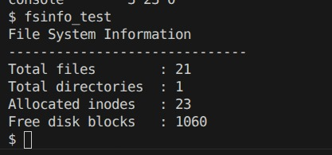
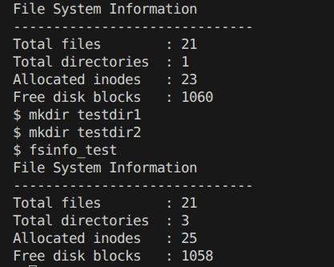
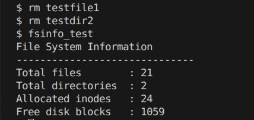

# File System Exploration in xv6

## Introduction
In this project, we will try to understand the working of xv6 file system and extend it's functionality adding a new system call. The aim is to study how files and directories are managed in xv6 and to implement a system call that returns useful information about the file system.

---

## System Overview
The xv6 file system has a Unix based design. It uses inodes to represent files and directories. Each inode contains metadata such as file type, size, and addresses of data blocks. The actual file data is stored in disk blocks, and directories are implemented as special files that map file names to inode numbers.

The system consists of:
- Inodes: store metadata of files
- Data blocks: store actual file content
- Directories: map file names to inode numbers, basically store inode numbers and not files
- Bitmap: Each bit in the bitmap represents a disk block where 0 indicates a free block and 1 indicates an allocated block.

---

## Part A: Understanding the File System

### Inode Structure
The inode structure is defined in `fs.h`. It stores important information such as:
- File type (file, directory, device)
- File size
- Number of links
- Addresses of data blocks

It does not store the file name. File names are stored in directory entries.

---

### File Size and Data Blocks
The file size is stored in the `size` field of the inode. The `addrs[]` array stores the addresses of the data blocks. 
These point to data blocks for direct addressing and the last one is a single indirect addressing pointer for larger files.

---

### Directory Structure
Directories are implemented as special files. Each directory contains entries that map FileName to Inode number.

The system locates the actual file using its inode.

---

### System Call Flow (open)
When a file is opened:
1. The user program calls `open()`
2. The kernel handles it in `sys_open()`
3. Path is resolved using `namei()`
4. Inode is loaded using `iget()`
5. A file descriptor is returned

---

## Part B: Implementation of File System Information System Call

### Objective
A new system call `fsinfo()` is implemented to return:
- Total number of inodes
- Number of files
- Number of directories
- Number of free disk blocks

---

### 1. New Structure Definition  

A new structure is created to store file system information.

**File:** `fsinfo.h`

```c
// ! ! ! we added this
struct fsinfo {
    int total_inodes;
    int free_blocks;
    int files;
    int directories;
};
```

It contains:
- total_inodes
- files
- directories
- free_blocks

---

### 2. System Call Implementation

File: `sysfile.c`

```c
// ! ! ! we added this
int sys_fsinfo(void) {
    struct fsinfo info;
    struct inode *ip;

    info.total_inodes = 0;
    info.files = 0;
    info.directories = 0;
```

```c
// ! ! ! we added this
for (int i = 1; i < NINODE; i++) {
    ip = iget(ROOTDEV, i);

    if (ip->type != 0) {
        info.total_inodes++;

        if (ip->type == T_FILE)
            info.files++;
        else if (ip->type == T_DIR)
            info.directories++;
    }

    iput(ip);
}
```
```c
// ! ! ! we added this
int m = 1 << (bi % 8);

if ((bp->data[bi / 8] & m) == 0)
    free_blocks++;
```
```c
// ! ! ! we added this
copyout(myproc()->pagetable, argaddr(0), (char*)&info, sizeof(info));
```


A new function is added which:
- Traverses the inode table
- Counts active inodes
- Differentiates between files and directories
- Scans the bitmap to count free disk blocks
- The kernel cannot directly access user memory, so the copyout() function is used to safely transfer data from kernel space to user space.

The inode traversal is done using `iget()` and `iput()` functions.  
The bitmap is scanned block by block to check whether a block is free or allocated.

---

### 3. System Call Registration

The system call is added into the xv6 system by:

- Adding a syscall number in `syscall.h`
- Adding entry in syscall table in `syscall.c`
- Declaring the function in `user.h`
- Adding syscall entry in `usys.S`


```c
// ! ! ! we added this
#define SYS_fsinfo 23
```
```c
// ! ! ! we added this
[SYS_fsinfo] sys_fsinfo,
```
```c
// ! ! ! we added this
SYSCALL(fsinfo)
```
---

## Part C: User Program

A user program is created to call the system call and display the results.

File: `fsinfo.c`

```c
// ! ! ! we added this
struct fsinfo info;
fsinfo(&info);
```

The program:
- Calls `fsinfo()`
- Receives the structure
- Prints all values in readable format

---
## Working of the Implementation

When the user runs the `fsinfo` program, the control moves from user space to kernel space and then back to user space. The flow is as follows:

1. The user program calls `fsinfo(&info)` from `fsinfo.c`, which looks like a normal function call.

2. This function is declared in `user.h` and linked to a system call using the macro in `usys.S`, which internally triggers an `ecall` instruction to switch from user mode to kernel mode.

3. The system call number defined in `syscall.h` is used by the kernel to identify the requested system call.

4. In `syscall.c`, this number is mapped to the corresponding kernel function `sys_fsinfo`, which is then executed.

5. Inside the kernel, the `sys_fsinfo` function in `sysfile.c` runs. It traverses the inode table using `iget()` and `iput()` to count active inodes, files, and directories.

6. The bitmap is scanned block by block to determine free disk blocks. Each bit represents a block, where 0 means free and 1 means allocated.

7. Since the kernel cannot directly access user memory, the collected data is copied back to user space using the `copyout()` function.

8. Control returns to the user program, and the values stored in the structure are printed on the terminal.

---

## Testing

The implementation was tested using different scenarios:

1. Running immediately after boot  

   

2. After creating files and directories  

   

   1) Number of files and directories increased  
   2) Free blocks decreased  

3. After deleting files  

   

   1) Number of files and directories decreased
   2) Free blocks increased  

The results were consistent with expected behavior.


## Conclusion

This assignment helped in understanding the working of a file system in xv6 and practical working of inodes and directories which we have learned in the theory lectures. Implementing a system call also enhanced our understanding of how user programs interact with the kernel.
